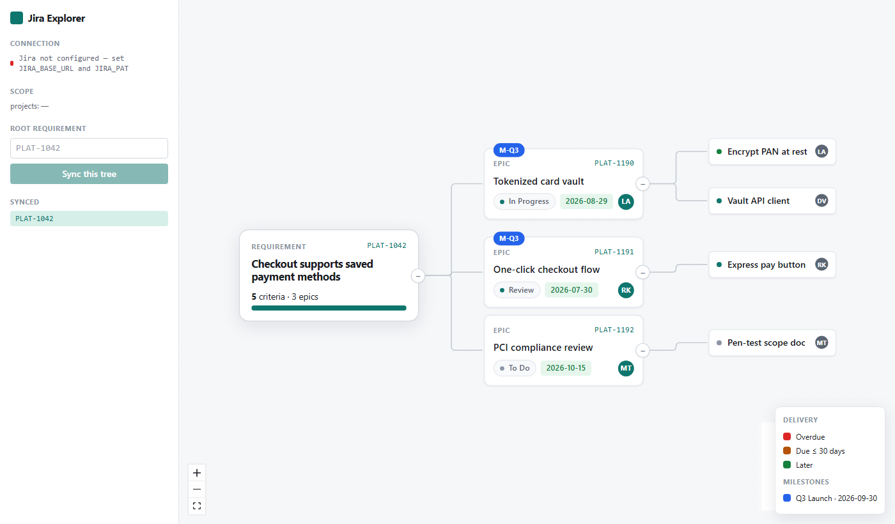

# Jira Explorer

Pull **your slice** of a Jira project into a navigable mindmap, edit the epics you own, and let an
LLM verify — with citations — that your epics actually cover each requirement's acceptance criteria.
Self-hosted, open source, built for **Jira Data Center**.



## Why

Jira's UI is painful when a project mixes many teams' work. You only care about your slice: a
**Requirement** (with acceptance criteria) → the **Epics** you create to implement it (each with a
delivery date) → the **Tasks** others break those into, plus PM **Milestones**.

The real idea isn't "a Jira viewer." It's **LLM-verified requirement coverage**: given a
requirement's acceptance criteria, prove which epic implements each one and flag the gaps. That's
tracker-agnostic — Jira Data Center is the first adapter (Atlassian's official MCP is Cloud-only, so
self-hosted DC is underserved), not the ceiling.

Unlike generic Jira MCP servers that expose raw `search_issues`/`get_issue`, this exposes the
**requirement-coverage model itself**: `get_requirement_coverage(KEY)` hands an LLM exactly what it
needs to answer "is this requirement covered?" and cite the epics.

## Quickstart (Docker)

```bash
cp .env.example .env        # set JIRA_BASE_URL and JIRA_PAT (a Jira DC Personal Access Token)
docker compose up --build
# open http://localhost:3000
```

Enter a requirement key (e.g. `PLAT-1042`), click **Sync this tree**, and the mindmap appears.

## Quickstart (dev)

```bash
npm install
cp .env.example .env        # set JIRA_BASE_URL + JIRA_PAT
npm run dev                 # server (3000) + Vite (5173) with /api proxy
# open http://localhost:5173
```

Useful scripts: `npm test` (Vitest), `npm run typecheck`, `npm run build:web`.

## Connect an LLM (MCP)

The server exposes an MCP endpoint so an assistant can read the tree, run the coverage check, and
write changes back to Jira (behind safety switches). Run it over **stdio** for local clients:

```bash
npm run mcp:stdio
```

or use the **HTTP** endpoint at `POST /mcp`. Full setup (Claude Desktop config), every tool with
example I/O, and the safety model are in **[docs/mcp.md](docs/mcp.md)**.

## Configuration

- **Connection:** `JIRA_BASE_URL` + `JIRA_PAT` (env). See `.env.example`.
- **Scope:** project keys / labels / extra JQL, in `.env` or the UI.
- **Profile:** how Requirement/Epic/Task/Milestone map onto *your* Jira (issue types, link types,
  field ids, and — most importantly — **where acceptance criteria live**). The default guesses a
  `## Acceptance Criteria` description section; tune it via the UI / `PUT /api/profile`. See
  **[docs/sample-profile.json](docs/sample-profile.json)**.

## How it works

```
web (React Flow mindmap) ──/api──▶ server (Express) ─┐
                                                     ├─▶ ExplorerService (one engine)
LLM ──MCP (stdio / HTTP)────────────────────────────┘        │
                                                  TrackerAdapter (Jira DC) · SQLite cache
```

- **3 packages:** `web` (Vite/React/Tailwind), `app` (the node engine + REST + MCP), `shared`
  (browser-safe types).
- The REST server and the MCP server are thin adapters over **one** `ExplorerService`, so an LLM's
  reads/writes behave identically to the UI's.
- Sync is batched JQL (chunked), full re-sync per run in one SQLite transaction; coverage history is
  kept for drift alerts.

Design system: [DESIGN.md](DESIGN.md) · Architecture/vision: [docs/designs/jira-explorer.md](docs/designs/jira-explorer.md)
· Deferred work: [TODOS.md](TODOS.md).

## Status

v1 in progress. Tracker-agnostic by design (a Linear/Cloud/GitHub adapter is one `TrackerAdapter`
away). Deferred: keyboard/screen-reader graph access, responsive layout, incremental sync.

## License

GPL-2.0-only. See [LICENSE](LICENSE) for the full license text.
